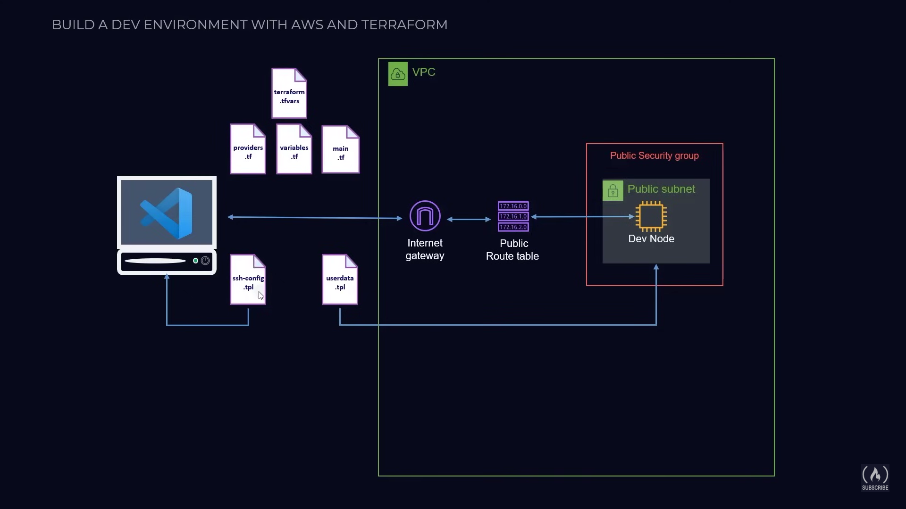

# Cloud Development Environment with Terraform and AWS 

This project configures a cloud-based development environment on AWS using Terraform, allowing direct access and management of an EC2 instance through VS Code. It’s part of my Cloud Resume Challenge and was created to enhance my Terraform skills, specifically in AWS resource provisioning, SSH configuration, and workspace integration for remote development.

## Project Overview

This project deploys an AWS EC2 instance within a custom VPC using Terraform. We configure VS Code to connect to the instance, providing command-line access and direct file management on the server, all from within VS Code. 

Key highlights:
- **Provisioning**: Using Terraform to automate the setup of networking resources (VPC, subnets, security groups) and the EC2 instance.
- **Configuration**: Setting up SSH access from VS Code, enabling seamless console and file explorer integration.
- **Access Management**: Using AWS IAM, key pairs, and security groups to securely manage access.

## Architecture Diagram

The architecture includes:
- A custom VPC with a public subnet.
- An Internet Gateway and Route Table for internet access.
- An EC2 instance in the public subnet with SSH access enabled.
- Security groups configured to allow secure access.

## Setup Instructions

To recreate this setup, follow these steps (detailed instructions can be found in [this YouTube tutorial](https://youtu.be/iRaai1IBlB0?si=3vtDKXboFfF5XgP6)):

1. **IAM User Creation**: Create an AWS IAM user with necessary access policies.
2. **Environment Setup**: Configure VS Code with the AWS Toolkit and set up credentials.
3. **Terraform Project Setup**: Create Terraform configuration files (`main.tf`, `providers.tf`) and initialize the project.
4. **Resource Deployment**: Deploy a VPC, subnets, an Internet Gateway, a security group, and an EC2 instance.
5. **Access Configuration**: Configure VS Code to SSH into the EC2 instance automatically.

## Code Walkthrough

### `main.tf`

This file defines the infrastructure resources, including:
- **Provider Configuration**: Specifies the AWS provider and region.
- **VPC and Subnet**: Sets up a custom VPC and a public subnet.
- **Internet Gateway and Route Table**: Enables internet access within the VPC.
- **Security Group**: Allows SSH access from specific IPs.
- **EC2 Instance**: Deploys the instance and configures the SSH access, enabling VS Code to connect.

### `providers.tf`

This file initializes the AWS provider and sets the shared credentials profile, which connects Terraform to your AWS account securely.

## What I Learned

Through this project, I gained experience in:
- **Terraform Syntax and Resource Management**: Writing and structuring Terraform configuration files, using modules, and managing resources in AWS.
- **AWS Networking and Security**: Creating VPCs, managing routing, configuring security groups, and handling IAM roles.
- **Troubleshooting and Debugging**: Overcoming common issues related to resource dependencies, access permissions, and configuration errors.
- **CI/CD Practices**: Integrating VS Code with AWS for a seamless cloud-based development workflow.
- **Terraform State Management**: Understanding state files, `terraform apply`, and `terraform destroy` workflows.

## Results

With the final setup, VS Code connects to the EC2 instance via SSH, allowing both console access and workspace management:
- **Terminal Access**: Use VS Code's integrated terminal to run commands directly on the instance.
- **File Management**: Open, edit, and manage files on the server as though they were local, making it ideal for remote development tasks.

## Project Resources

- **My Blog of this project**: [Access the full project repository here](https://nirajbhagwat.blogspot.com/2024/10/building-development-environment-on-aws.html))
- **YouTube Video Guide**: [Follow this guide for detailed steps](https://youtu.be/iRaai1IBlB0?si=3vtDKXboFfF5XgP6)
